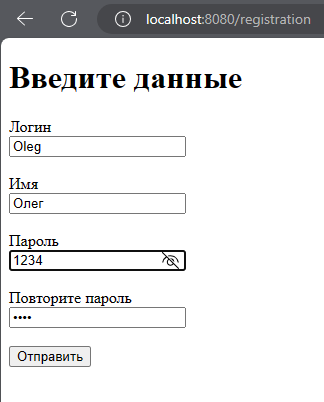
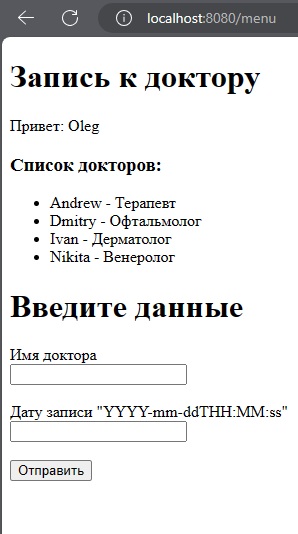
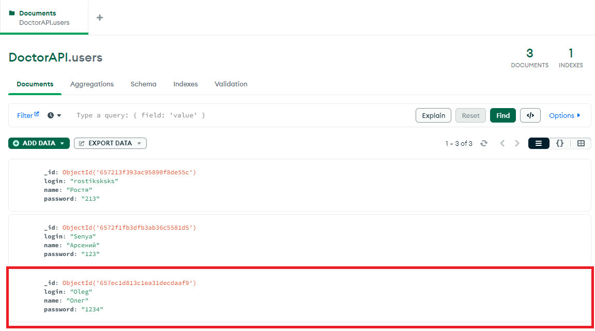
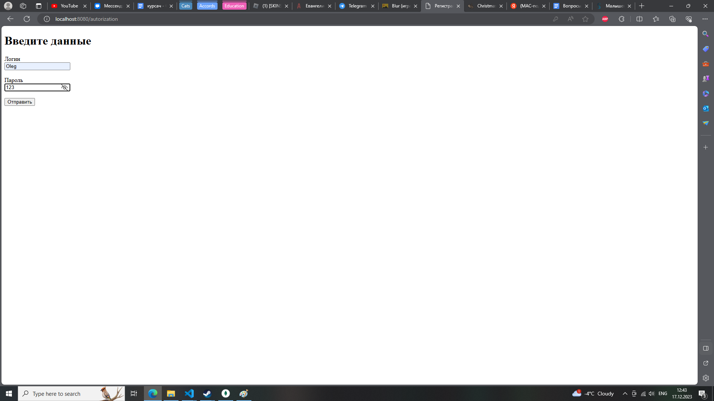
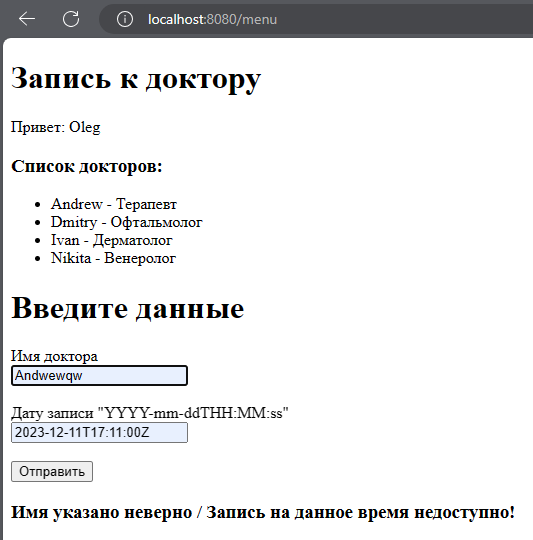
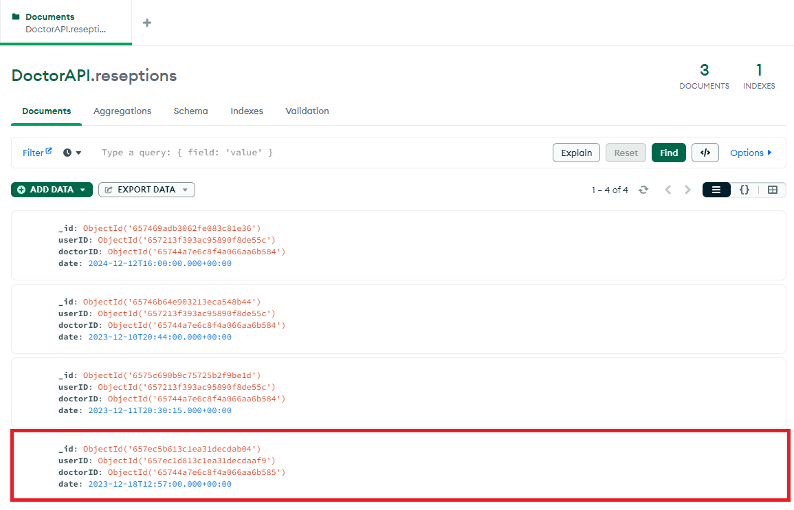
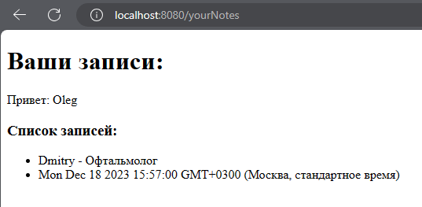
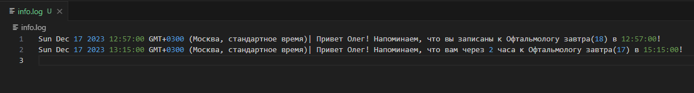

# Отчёт по лабораторной работе #4
Подготовил: Давыдов.Д.В, группа: ИПБ-21

## Результат:
В данной лабораторной работе использовались такие фреймворки, как:

1. express
2. mongoose
3. node.date-time

Использовалась нереляционная база данных - **mongoDB**.

Было сделано несколько web-интерфейсов со своей реализацией:

1. Авторизация
2. Регистрация
3. Запись на приём к доктору
4. Просмотр своих записей
   
Также был сделан вывод в **.log** файл уведомлений о приёме. За 2 часа, либо за день.

### Регистрация
Пользователь вводит уникальный логин и пароль, его данные заносятся в бд и идёт переадресация на web-страницу - главное меню. Например, введём нового пользователя.

Далее, при отправке данных, данный пользователь появится в бд и его переадресует при помощи **redirect** на web-страницу - главное меню.

База данных выглядит следующим образом:

### Авторизация
Теперь, когда у нас есть в базе данный пользователь, можно войти в его аккаунт:

Если пароль указан неверно, то произойдёт переадресация на ту же страницу. То есть, не пропустит дальше. Если же всё будет хорошо, то, также, как и в регистрации, произойдёт переадресация на web-страницу - форму входа.

### Запись на приём к доктору

В поле меню вводится имя нужного доктора и дата. Если же данные указаны неверно, то отобразится сообщение об ошибке: 

Если же всё указано верно, то в бд добавится информация о записи: кто записан, к кому записан и на какое время. Например, запишемся на 18.12.2023:12.57. Также, произойдёт переадресация на web-страницу - просмотр своих записей:

Информация о записях:

### Вывод в .log файл

В специальный **.log** файл отправляется информация о записи за 1 день и за 2 часа до приёма.

##  Ответы на вопросы
1. Какие есть виды и типы баз данных с примерами?
- Реляционные базы данных (например, MySQL, PostgreSQL, Oracle)
- Нереляционные базы данных (например, MongoDB, Cassandra, Redis)
- Объектно-ориентированные базы данных (например, db4o, ObjectDB)
- Иерархические базы данных (например, IBM IMS)

2. В чём различие между Web-сервером и оболочкой, как
например NodeJS?
- Web-сервер обрабатывает запросы от клиентов (браузеров) и возвращает им запрашиваемые данные (например, HTML страницы, изображения), а также может обрабатывать динамические запросы (например, PHP, NodeJS).
- Оболочка, такая как NodeJS, является средой выполнения JavaScript на сервере. Она позволяет создавать серверные приложения, обрабатывать HTTP запросы, работать с файловой системой и т.д.

3. По какому API соединяются фреймворк и база данных в
данном задании?

API для соединения фреймворка и базы данных зависит от используемых технологий. В данном задании использовалась NodeJS в качестве фреймворка и MongoDB в качестве базы данных. Для соединения можно использовать официальный драйвер MongoDB для NodeJS.